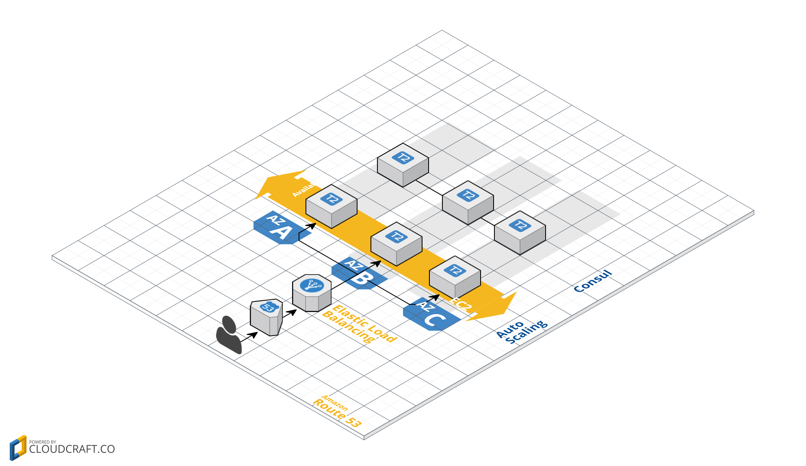

# Terraform & Consul Demo

Demonstration of infrastructure that can be configured with [HashiCorp](https://www.hashicorp.com) tools

## Requirements
* Install [Terraform](https://www.terraform.io/intro/getting-started/install.html).
* Configure AWS `api` [profile](http://docs.aws.amazon.com/cli/latest/reference/configure/). 
* Ssh key in `~/.ssh/id_rsa.pub`
* Run `terraform plan`.
* If the plan looks good, run `terraform apply`.

## Main.tf
The first example creates an autoscaling web farm distributed across all [Availability Zones](http://docs.aws.amazon.com/AWSEC2/latest/UserGuide/using-regions-availability-zones.html) of a given region.  It sets up Elastic Load Balancer with health checks to expose the farm via a single domain name.

## Consul.tf
The second example creates a consul cluster distributed across all availability zones.  The servers find each other using AWS priviledges.

In this example terraform automatically creates IAM policies to enable auto join feature for consul on AWS.  The following permissions are required in order to make that automatic.

- iam:CreatePolicy
- iam:CreateRole
- iam:CreateInstanceProfile
- iam:AttachRolePolicy
- iam:AddRoleToInstanceProfile
- iam:PassRole

However in production, the only required IAM permission is ec2:DescribeInstances, and it is recommended that you make a dedicated key for auto-joining.

Also the following IAM Policies are needed for terraform to clean up the IAM Policy it creates above
- iam:DetachRolePolicy
- iam:RemoveRoleFromInstanceProfile
- iam:DeleteInstanceProfile
- iam:DeleteRole
- iam:DeleteRolePolicy
- iam:DeletePolicy

## Clean up
With Terraform clean up is easy - run `terraform destroy`.

## Note
These examples are NOT hardened for production use, they are for demonstration purposes only.
These examples were setup using the latest available versions:

- Terraform v0.9.3
- Consul v0.8.0
